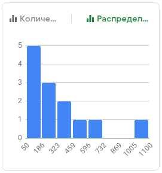
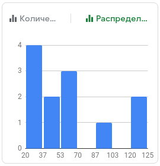
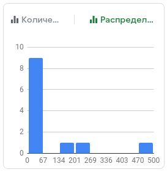
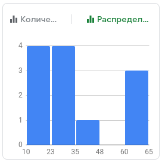
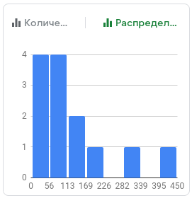

# Лабораторная работа №2. Activity Lifecycle. Alternative resources.  

```
Среднее: 320 мин
Медиана: 205 мин
```



## Цели  
* Ознакомиться с жизненным циклом Activity  
* Изучить основные возможности и свойства alternative resources  
  
## Задачи  
### Задача 1. Activity  

```
Среднее: 58 мин
Медиана: 55 мин
```


#### Задание  
Продемонстрируйте жизненный цикл Activity на любом нетривиальном примере.  
  
#### Пояснения  
* Тривиальными считаются следующие примеры:  
  * Создание/открытие/закрытие приложения (кроме случаев нестандартного завершения работы: SIGKILL, Force Stop, etc.)
  * Поворот экрана  
* Не обязательно проходить по всем lifecycle методам  
  
#### Указания  
* Проявите фантазию и деструктивные способности: попробуйте позвонить на устройство, отправить СМС (эмулятор поддерживает все эти опции), выключить-включить экран, перезагрузить устройство и т.п.  
* Объясните наблюдаемое поведение в отчете  
* Для решения (только этой) задачи можно объединиться в пары или тройки (в отчете укажите, сколько человек было в группе)  
  
### Задача 2. Alternative Resources
```
Среднее: 95 мин
Медиана: 30 мин
```


#### Задание  
Привести пример использования альтернативного ресурса (тип ресурса согласно [варианту](VARIANTS02.md)).  
  
#### Указания:  
* Изучите альтернативные ресурсы по документации (https://developer.android.com/guide/topics/resources/providing-resources)
* Сочините пример, в котором применение предложенного альтернативного ресурса приносит пользу. Опишите пример и полезный эффект в отчете.
* Обратите внимание, что задание заключается не в том, чтобы описать, как именно выбирается альтернативный ресурс и в какую папку его положить, а в том, чтобы предложить, как его использовать на практике в реальных условиях.
* Демонстрация на эмуляторе или в Android Studio не обязательна. Достаточно словесного описания.
  
### Задача 3. Best-matching resource  
```
Среднее: 32 мин
Медиана: 30 мин
```


#### Задание
Для заданного набора альтернативных ресурсов, предоставляемых приложением, и заданной конфигурации устройства (оба параметра согласно [варианту](VARIANTS03.txt)) объясните, какой ресурс будет выбран в конечном итоге. Объяснение должно включать пошаговое исполнение алгоритма best matching с описанием того, какие ресурсы на каком шаге отбрасываются из рассмотрения и почему.
  
#### Указания:  
* Изучите алгоритм для best-matching resource по документации: https://developer.android.com/guide/topics/resources/providing-resources#BestMatch  
* В отчете приведите аналогичные рассуждения (пошаговое исполнение алгоритма) для ситуации из варианта.  
  
### Задача 4. Сохранение состояние Activity.
```
Среднее: 126 мин
Медиана: 105 мин
```


Студент написал приложение: [continuewatch](continuewatch). Это приложение [по заданию](continuewatch/README.md) должно считать, сколько секунд пользователь провел в этом приложении.  

#### Задача 4.1. Поиск ошибок.

Найдите и опишите все ошибки в этом приложении, которые можете найти.

#### Указания:  
* Для поиска ошибок запустите приложение на устройстве или эмуляторе и проверьте, что приложение делает то, что он него ожидается (фактически, необходимо выполнить ручное тестирование приложения). 

#### Задача 4.2. Сохранение состояние Activity (1).

Исправьте неправильный подсчет времени в приложении ContinueWatch с использованием `onSaveInstanceState`/`onRestoreInstanceState` 
(https://developer.android.com/guide/components/activities/activity-lifecycle#save-simple,-lightweight-ui-state-using-onsaveinstancestate).


#### Задача 4.3. Сохранение состояние Activity (2).

Исправьте неправильный подсчет времени в приложении ContinueWatch с использованием Activity Lifecycle callbacks и Shared Preferences (https://developer.android.com/training/data-storage/shared-preferences).


#### Задача 4.4. Сравнение решений.

Продемонстрируйте, что приложения из 4.1 и 4.2 имеют разное поведение. Объясните поведение в каждом случае.

# Общие Рекомендации

Для того, чтобы поделиться экраном физического устройства через видеоконференцию, можно воспользоваться утилитой scrcpy (https://github.com/Genymobile/scrcpy)


## Отчет  
Отчет должен содержать формулировку целей, решения задач с ответами на дополнительные вопросы из раздела «указания», выводы. Выводы должны содержать убедительное обоснование, почему автор отчета считает, что все цели были достигнуты. Например, обоснование может включать краткую информацию о том, как достигалась каждая из поставленных целей.

## Дополнительные файлы

1. Отчёт или сопроводительное письмо должны содержать ссылку на полный проект с решением задачи 4 (например, ссылку на репозиторий в github), который можно загрузить в Android Studio.

## Статистика (по желанию)
В отчете укажите примерное время решения каждой из предложенных задач, включая время ознакомления со справочными материалами (время решения не влияет на оценку: только на сбор статистики для корректировки сложности задач в будущем).


## Вспомогательные материалы:  
### Основные
* https://classroom.udacity.com/courses/ud9012 (Lesson 4 “Activity & Fragment Lifecycle”)  
* https://developer.android.com/guide/components/activities/activity-lifecycle  
* https://developer.android.com/guide/topics/resources/providing-resources
* https://startandroid.ru/ru/uroki/vse-uroki-spiskom/133-urok-70-onsaveinstancestate-sohranenie-dannyh-activity-pri-povorote-ekrana.html

### Дополнительные (на русском языке)  
* https://startandroid.ru/ru/uroki/vse-uroki-spiskom/60-urok-23-activity-lifecycle-v-kakih-sostojanijah-mozhet-byt-activity.html  
* https://startandroid.ru/ru/uroki/vse-uroki-spiskom/61-urok-24-activity-lifecycle-primer-smeny-sostojanij-s-dvumja-activity.html  
