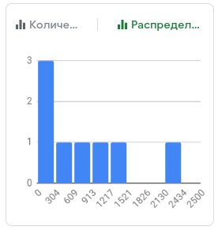
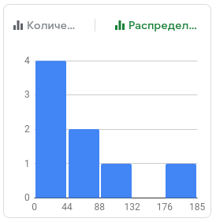
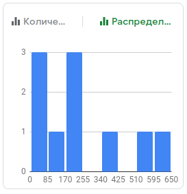

# Лабораторная работа №3. Lifecycle компоненты. Навигация в приложении. 
```
Среднее: 854 мин
Медиана: 645 мин
```


## Цели  
* Познакомиться с Google Codelabs и научиться его использовать как способ быстрого изучения новых фреймворков и технологий
* Изучить основные возможности навигации внутри приложения: создание новых activity, navigation graph  
  
## Задачи
### Задача 1.

Выберите хотя бы одну из подзадач и выполните предложенное в ней задание.

#### Задание 1.а. Обработка жизненного цикла с помощью Lifecycle-Aware компонентов

```
Среднее: 107 мин
Медиана: 60 мин
```


Познакомьтесь с Lifecycle-Aware Components по документации: https://developer.android.com/topic/libraries/architecture/lifecycle и выполните codelabs (ссылка внизу страницы в разделе codelabs)

#### Задание 1.б. Использование Jetpack Compose для верстки layouts
Познакомьтесь с содержимым курса [Jetpack Compose](https://developer.android.com/courses/pathways/compose) и выполните codelab "Jetpack Compose basics"

#### Указания  
* В отчете укажите, какую новую полезную информацию/навыки удалось усвоить/получить в процессе выполнения задания.

* Пересказывать codelab не нужно: ответы на все задания есть в самом codelab. В устной беседе будьте готовы объяснить, как работает тот или иной шаг codelab.
  
### Задача 2. Навигация (`startActivityForResult`)

```
Среднее: 266 мин
Медиана: 120 мин
```


#### Задание
Реализуйте навигацию между экранами одного приложения согласно изображению ниже с помощью `Activity`, `Intent` и метода `startActivityForResult`.


#### Пояснения
* Приложение начинает работу с отображения Activity 1
* Кнопка 'to first' отображает на экране Activity 1
* Кнопка 'to second' отображает на экране Activity 2
* Кнопка 'to third' отображает на экране Activity 3
* В любой момент в backstack любого task приложения должно быть не более 4 activity
* Во всех вариантах Activity 'About' должна быть доступна из любой другой Activity одним из способов согласно варианту.
* Activity в BackStack (кроме About) всегда остаются в одном и том же порядке: 1-2-3


#### Варианты задания
Во всех вариантах Activity 'About' должна быть доступна из любой другой Activity одним из указанных способов:

* Варианты 1,4,7,10,...: [Navigation Drawer](https://developer.android.com/guide/navigation/navigation-ui#add_a_navigation_drawer)
* Варианты 2,5,8,11,...: [Bottom Navigation](https://developer.android.com/guide/navigation/navigation-ui#bottom_navigation)
* Варианты 3,6,9,12,...: [Options Menu](https://developer.android.com/guide/topics/ui/menus#options-menu)

#### Указания
* Для решения задачи понадобятся методы `Activity` (https://developer.android.com/reference/android/app/Activity.html#starting-activities-and-getting-results):
  * `startActivity`, `startActivityForResult`
  * `setResult`, `onActivityResult`
  * `finish`
* Каждую `Activity` необходимо зарегистрировать в файле AndroidManifest.xml. В отчете укажите, что произойдет, если забыть зарегистрировать Activity.
* Не используйте флаги `Intent` и атрибуты `Activity` в этом задании.
* Для решения задачи не потребуется `getSystemService(Context.ACTIVITY_SERVICE)`
* Все решения (этой и следующих задач) должны приводить к одному и тому же графу навигации (за исключением очевидного отличия в задаче 4)
* Используйте `adb shell dumpsys activity` (см. https://stackoverflow.com/a/2444741/13482100), чтобы наблюдать за back stack. Используя результат выполнения команды, продемонстрируйте в отчете, что в back stack не появляется дубликатов Activity и порядок Activity правильный.
* Используйте [эту подсказку](ANSWER02.md) только если не удалось решить задачу самостоятельно.

### Задача 3. Навигация (флаги Intent/атрибуты Activity)

```
Среднее: 82 мин
Медиана: 30 мин
```


#### Задание
Решите предыдущую задачу с помощью Activity, Intent и флагов Intent либо атрибутов Activity.

#### Указания
* Не используйте `startActivityForResult` в этом задании.
* Используйте `adb shell dumpsys activity` (см. https://stackoverflow.com/a/2444741/13482100), чтобы наблюдать за back stack. Используя результат выполнения команды, продемонстрируйте в отчете, что в back stack не появляется дубликатов Activity и порядок Activity правильный.

### Задача 4. Навигация (флаги Intent/атрибуты Activity)

```
Среднее: 60 мин
Медиана: 45 мин
```



Дополните граф навигации новым(-и) переходом(-ами) с целью демонстрации какого-нибудь (на свое усмотрение) атрибута `Activity` или флага `Intent`, который еще не использовался для решения задачи. Поясните пример и работу флага/атрибута.

Ограничение на размер back stack к этому заданию не применяется.

### Задача 5. Навигация (Fragments, Navigation Graph)

```
Среднее: 231 мин
Медиана: 178 мин
```



Решите исходную задачу с использованием navigation graph. Все `Activity` должны быть заменены на `Fragment`, кроме Activity 'About', которая должна остаться самостоятельной `Activity`.
В отчете сравните все решения.

#### Указания
* Познакомьтесь с navigation graph, используя документацию (https://developer.android.com/guide/navigation/navigation-getting-started) или видеоурок (https://classroom.udacity.com/courses/ud9012 Lesson 3 “App Navigation”)
* Для отображения layout в fragment используйте метод `onCreateView` (см. пример: https://developer.android.com/guide/components/fragments#UI).
* Обратите внимание на поведение кнопки "back": по нажатию на эту кнопку из 3го фрагмента пользователь всегда должен попадать во 2й, из 2го — в 1й. При нажатии back в 1м фрагменте приложение завершается. Точно такое же поведение ожидается в решении задач 2 и 3.
* About Activity также должна запускаться с помощью navigation graph.
* Обратите внимание, что есть понятия secondary navigation и global action.

 
# Общие Рекомендации

## Отчет  
Отчет должен содержать формулировку целей, решения задач с ответами на дополнительные вопросы из раздела «указания», выводы. Выводы должны содержать убедительное обоснование, почему автор отчета считает, что все цели были достигнуты. Например, обоснование может включать краткую информацию о том, как достигалась каждая из поставленных целей.

## Дополнительные файлы

1. Отчёт или сопроводительное письмо должны содержать ссылку на полный проект с решением всех задач (или несколько проектов), который можно загрузить в Android Studio.

## Статистика (по желанию)
В отчете укажите примерное время решения каждой из предложенных задач, включая время ознакомления со справочными материалами (время решения не влияет на оценку: только на анонимный сбор статистики для корректировки сложности задач в будущем).
  
## Вспомогательные материалы:  
### Основные
* https://classroom.udacity.com/courses/ud9012 (Lesson 3 “App Navigation”)
* https://developer.android.com/reference/android/app/Activity.html#StartingActivities
* https://developer.android.com/topic/libraries/architecture/lifecycle

### Дополнительные (на русском языке)  
```
 _________________
|                 | 
| пока ничего нет |
|_________________|
        ||
  (\(\  ||
  ( -.-)づ
  O_(")(")
```
